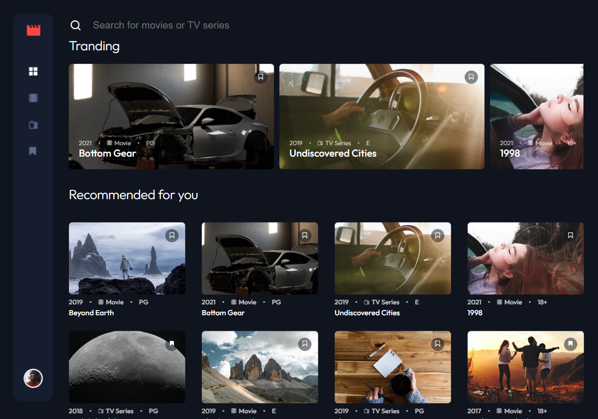

# Frontend Mentor - Entertainment web app solution

This is a solution to the [Entertainment web app challenge on Frontend Mentor](https://www.frontendmentor.io/challenges/entertainment-web-app-J-UhgAW1X). Frontend Mentor challenges help you improve your coding skills by building realistic project.

## Table of contents

- [Overview](#overview)
  - [The challenge](#the-challenge)
  - [Screenshot](#screenshot)
  - [Links](#links)
- [My process](#my-process)
  - [Built with](#built-with)
  - [What I learned](#what-i-learned)
  - [Continued development](#continued-development)
- [Author](#author)

## Overview

### The challenge

Users should be able to:

- View the optimal layout for the app depending on their device's screen size
- See hover states for all interactive elements on the page
- Navigate between Home, Movies, TV Series, and Bookmarked Shows pages
- Add/Remove bookmarks from all movies and TV series
- Search for relevant shows on all pages

### Screenshot

### Links

- Solution URL: [solution URL](https://github.com/dreams65/entertainment-web-app)
- Live Site URL: [live site URL](https://dreams65.github.io/entertainment-web-app/)

## My process

### Built with

- Semantic HTML5 markup
- CSS custom properties
- Flexbox
- CSS Grid
- [React](https://reactjs.org/)
- [Redux Toolkit](https://redux-toolkit.js.org/)
- [Swiper Slider](https://swiperjs.com/)

### What I learned

I learned the basics of using the state manager and effectively using the basic ReactJS hooks

### Continued development

Create a complete application using NodeJS and a database. Implement user registration and login. Also the page of the user's personal account.

## Author

- Frontend Mentor - [@dreams65](https://www.frontendmentor.io/profile/dreams65)
- LinkedIn - [Mykola Shtefan](https://www.linkedin.com/in/design-n-web-dev/)

